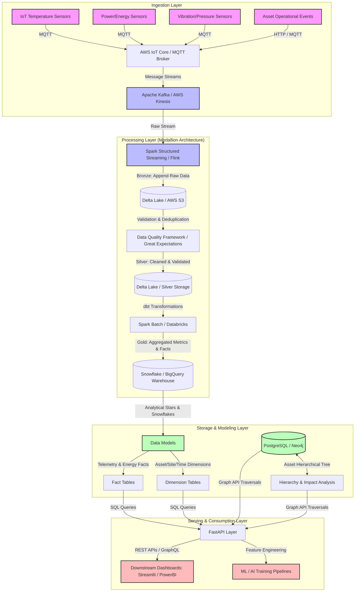
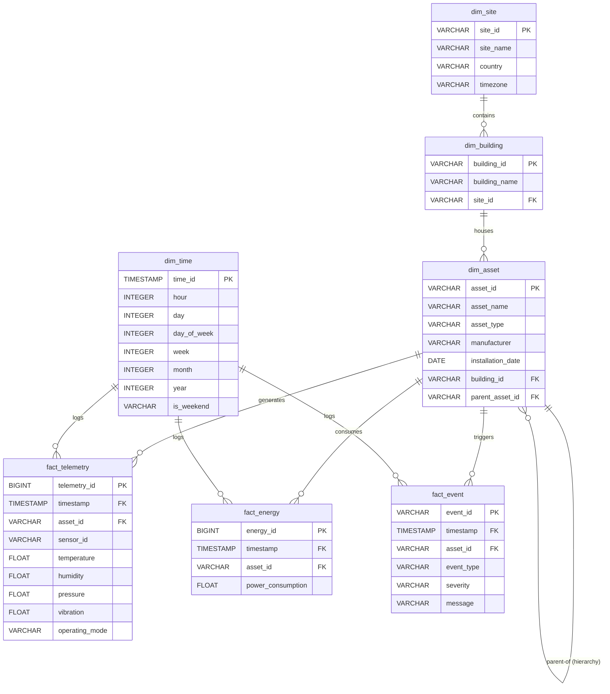

# Nectar Data Engineer Challenge - Data Architecture Design

## 1. System Architecture

Below is the proposed high-level system architecture designed to ingest, process, store, and serve high-volume IoT telemetry and event data from thousands of devices across multiple sites.

### Component Selection Rationale
1. **AWS IoT Core & Apache Kafka:**
   * Provides lightweight, scalable, and secure connectivity for thousands of IoT devices via MQTT. Kafka buffers high-throughput message streams, decoupling ingestion from downstream storage and processing.
2. **Medallion Architecture (Bronze -> Silver -> Gold):**
   * **Bronze (Raw):** Preserves historical raw telemetry (fault-tolerant, reproducible pipelines).
   * **Silver (Cleaned):** Filters missing values, duplicates, and performs schema validation.
   * **Gold (Business Level):** Holds aggregated facts (hourly, daily metrics) ready for dashboards and analytics.
3. **Delta Lake & Apache Spark:**
   * Enables ACID transactions on object storage (S3/ADLS), schema enforcement, time travel, and high-performance querying. Spark handles massive parallel ingestion and batch transformations.
4. **Snowflake or Google BigQuery:**
   * Serverless, fully managed MPP data warehouses optimized for analytical queries (dashboarding, ad-hoc BI, historical reporting).
5. **Neo4j or PostgreSQL (for Hierarchy):**
   * Hierarchical connections (e.g. Site -> Building -> Chiller -> AHU) are highly recursive. A graph-based schema or a relational database with recursive CTEs (Common Table Expressions) allows flexible parent-child querying and downstream impact analysis.

---

## 2. Analytical Data Model (ER Diagram)

To support dashboarding, historical reporting, and ML workloads, we design a star-like analytical schema.

### Partitioning Strategy
- **`fact_telemetry` and `fact_energy`:** Partitioned by `timestamp` (daily or monthly depending on volume) and sub-partitioned by `site_id` (or `site_id` included in clustering key). This ensures queries focusing on specific sites or timeframes prune unnecessary partitions.
- **`dim_time`:** Populated statically or dynamically, acts as a shared lookup table.

### Indexing Strategy
- Primary Keys (`PK`) and Foreign Keys (`FK`) are indexed automatically in most warehouses or relational engines (like Postgres/SQLite).
- Composite indexes on `(asset_id, timestamp)` for facts are crucial for time-series range queries (e.g. fetching last 24h telemetry for a specific chiller).

---

## 3. Design Assumptions
- Telemetry measurements occur regularly (e.g. every 15 minutes).
- Energy consumption is represented as a continuous cumulative/differential reading (kW or kWh).
- Missing values in sensor readings can be filled or flagged (our pipeline flags them in the quality report but loads them or handles them according to specific business rules).
- Disconnected assets are nodes present in the Asset registry but completely lacking any connections or active telemetry reporting.
